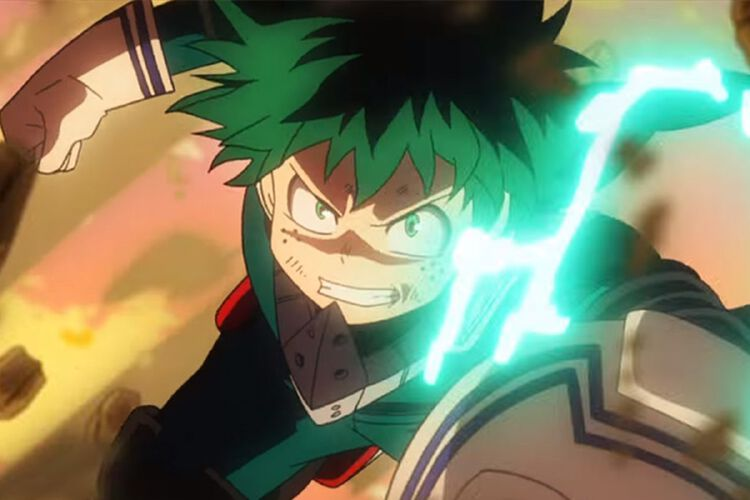
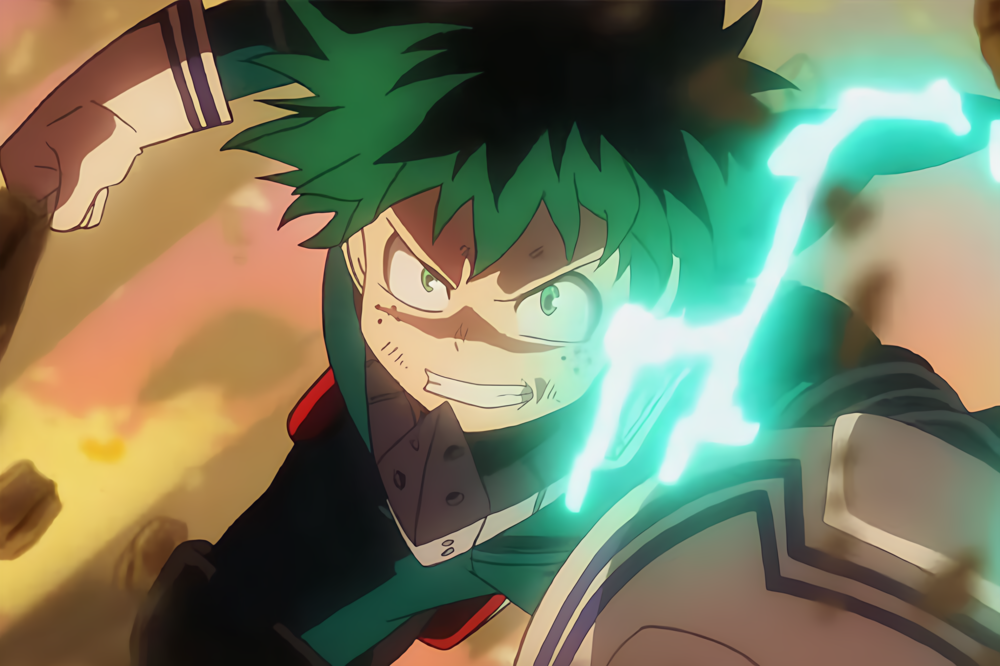
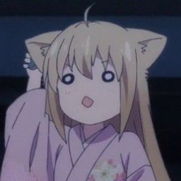
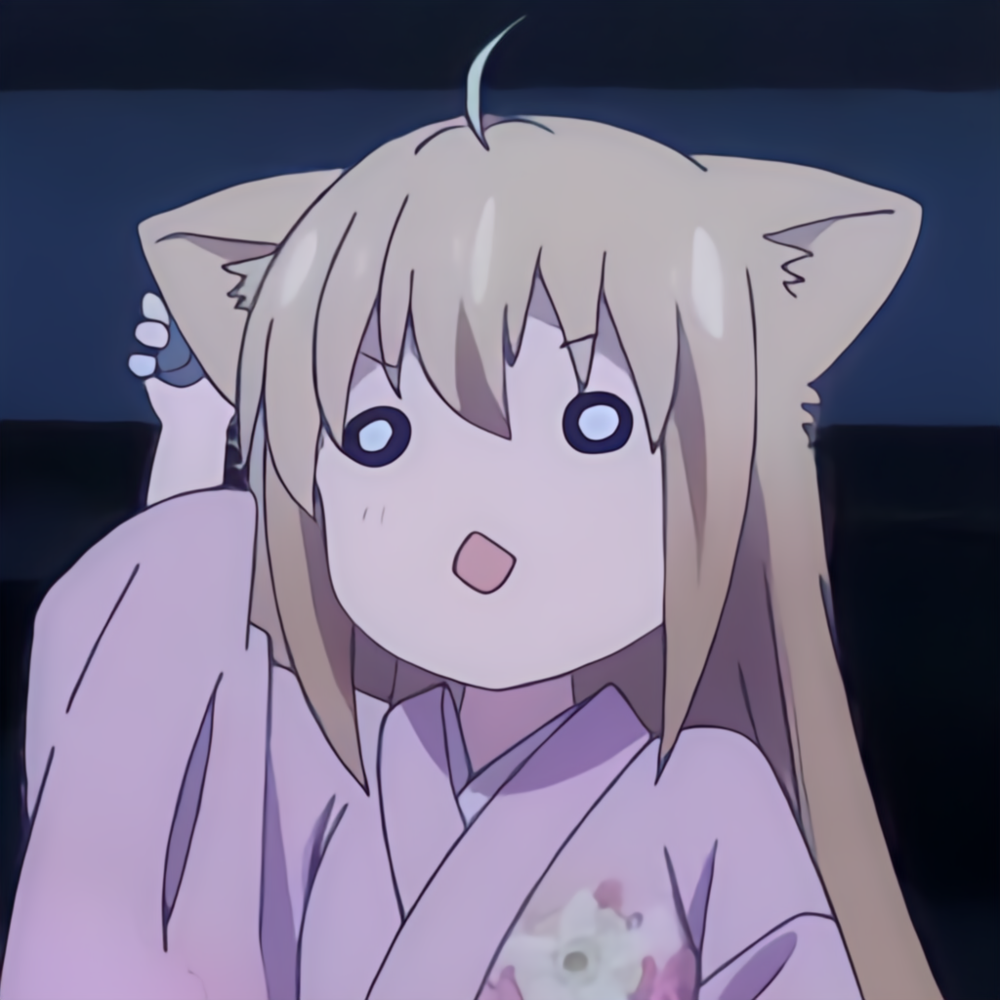
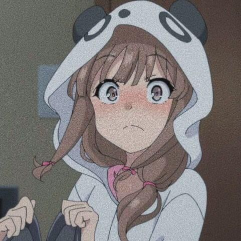
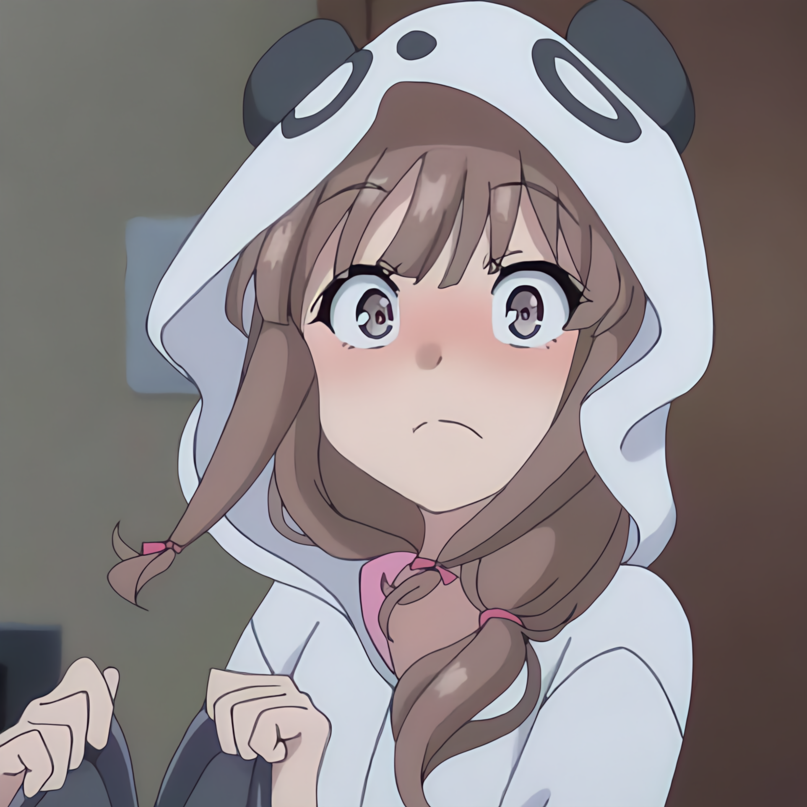
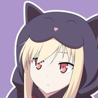
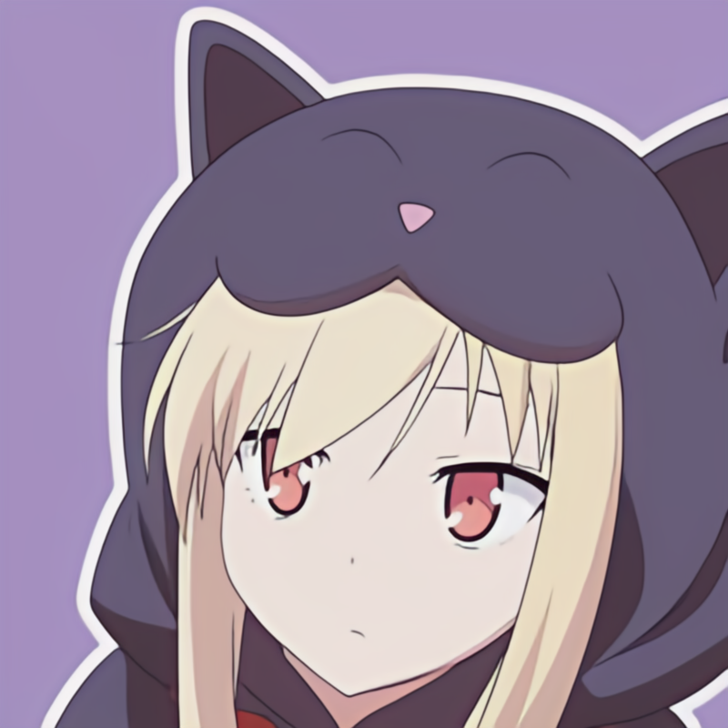
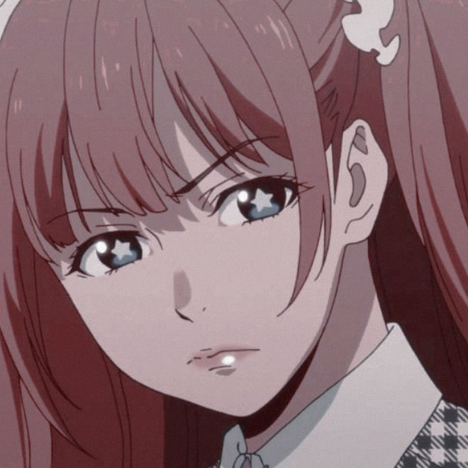
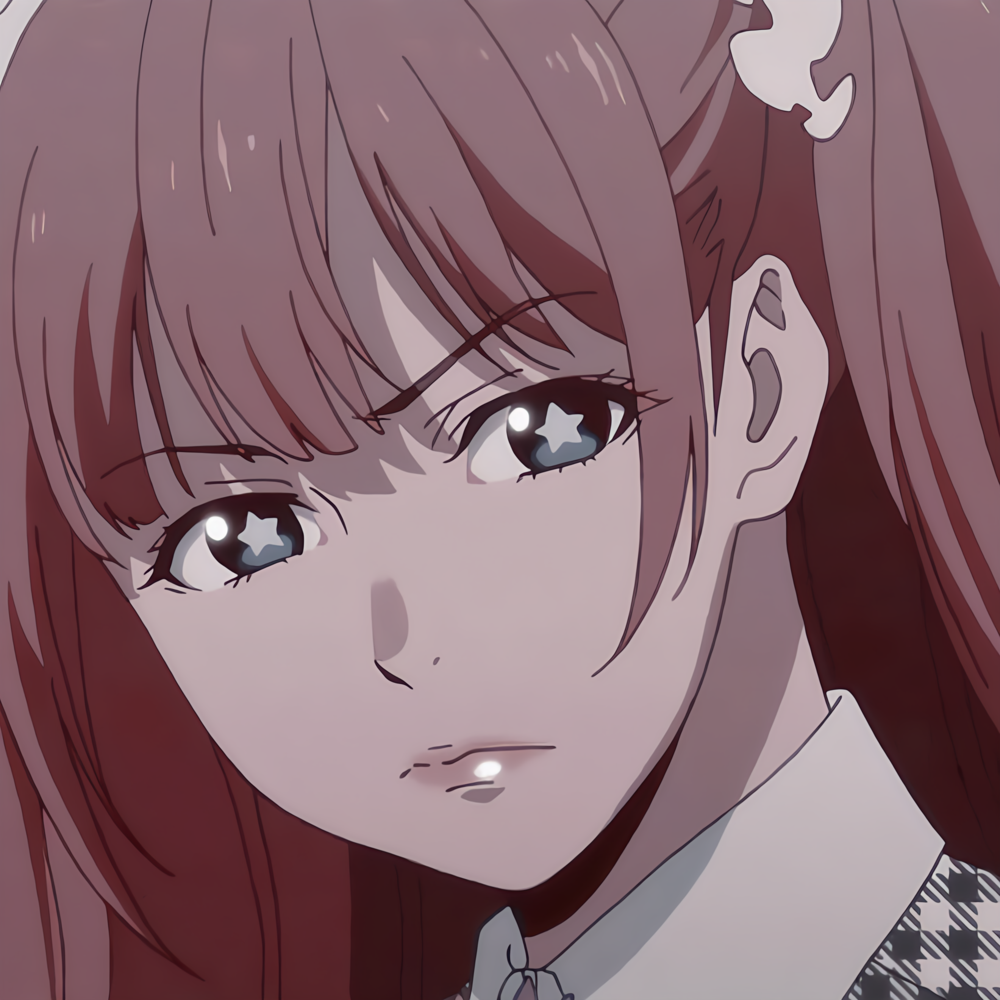

# Real-ESRGAN TensorFlow

This repository contains the code for the Real-ESRGAN framework used to increase the resolution of images, aka super resolution. You can find the code from the original authors [here](https://github.com/xinntao/Real-ESRGAN), which uses PyTorch instead of TensorFlow.

This work is also based on the [Real-ESRGAN: Training Real-World Blind Super-Resolution with Pure Synthetic Data](https://arxiv.org/abs/2107.10833) paper.

Most of the functions are just translations of PyTorch to TensorFlow from the original repository.

The presented version was trained using an anime dataset, to be exact, frames from My Little Witch Academia anime were used as the training dataset.

Inside the *models* folder you can find two versions of the generator, one uses the *exponential moving average* technique and the other is the original model.

## Training

Once you have installed the dependencies:

```
requirements.txt
```

And downloaded or created some dataset, you need to put your images inside the *data/final_shots* folder or change the following code:

```
data_path = os.path.abspath("./data/final_shots/*.png")
```

To train the model in one step run:

```
python train.py --save_gan_model --save_ema_model
```

once finished you need to train the whole framework (Generator + Discriminator):

```
python train_gan.py --load_gan --save_gan_model --save_ema_model
```

If you want to run multiple steps you can run:

```
python train.py --epochs=5000
```

then

```
python train.py --epochs=7000 --save_gan_model --save_ema_model --continue_training
```

Now the whole framework:

```
python train_gan.py --load_gan --epochs=5000
```

then

```
python train_gan.py --epochs=7000 --save_gan_model --save_ema_model --continue_training
```

The default batch size is 14 which works well with GPU's with 16gb of VRAM.

## Use model

put your images inside the *data/test_shots* folder and run:

```
python use_model.py --use_ema_model --batch_size=1
```

adjust the batch size according to the number of images inside the *data/test_shots* folder.

For a 16gb GPU you should use images of a medium size, around 750x500 or below. If you want to use a larger batch size you need smaller images, around 500x500 or below.

## Testing

You can also test some code, like models, loss functions and the generator:

```
python -m unittest -v test/test_loss.py

python -m unittest -v test/test_model.py

python -m unittest -v test/test_data_generator.py
```

## Examples

### Original Image



### Final Image



### Original Image



### Final Image



### Original Image



### Final Image



### Original Image



### Final Image



### Original Image



### Final Image

